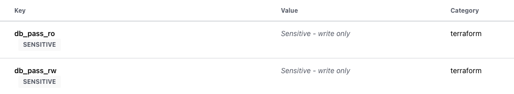

# Description >

<!-- BEGIN_TF_DOCS -->

## aws-secrets-manager FOR TFC

===

용도:

- AWS secret-manager 생성

===
vars 예시 >

```yaml
###############################################################################
# var defintion
###############################################################################

# pw 는 tfc 콘솔상에 기재
variable "db_pass_ro" { type = string }
variable "db_pass_rw" { type = string }

variable "secrets" {
  description = "secrets for secret-manager"
  type = list(object({
    name            = string
    sec = object({
      db_host_ro                 = optional(string, "")
      db_host_rw                 = optional(string, "")
      db_user_ro                 = optional(string, "")
      db_user_rw                 = optional(string, "")
    })
  }))
}
```

#### pw 같이 민감한 정보는 보안상의 이유로 소스코드 내 var 선언 외 value 값은 tfc 콘솔상에 별도 기재



tfvars 예시 >

```yaml

secrets = [{
  name      = "test-dev/db-info"
  sec = {
    db_host_ro  = "database-xxx.ap-northeast-2.rds.amazonaws.com"
    db_host_rw  = "database-xxx.ap-northeast-2.rds.amazonaws.com"
    db_user_ro  = "db_ro_user"
    db_user_rw  = "db_rw_user"
    # db_pass_ro  = ""
    # db_pass_rw  = ""
  },

}]

```

<!-- END_TF_DOCS -->
